# Resolver batching to avoid N+1

TiDB GraphQL resolves nested relationship fields with request-scoped batching to avoid N+1 query patterns. The goal is simple: keep GraphQL query shapes expressive while keeping database round trips bounded and predictable.

## Why batching exists

Generated GraphQL schemas expose many nested relationship paths (lists, connections, aggregates). Without batching, a query that returns `N` parent rows and asks for a nested relationship can trigger `N` extra SQL statements for that nested field.

Batching keeps API semantics the same, but changes execution from:

- `1 + N` relationship queries (per-parent),

to:

- `1 + K` relationship queries, where `K` is usually small and bounded by chunking.

## Request-scoped batching model

Batching state is attached once per GraphQL request using `resolver.NewBatchingContext(...)` (in the server request path), then reused by relationship resolvers in that request.

Core flow:

1. A parent resolver loads rows.
2. `seedBatchRows(...)` stamps each row with an internal parent key and stores rows in the request batch state.
3. Child relationship resolver calls its `tryBatch*` helper.
4. Helper gathers all relevant parent keys, builds a batched SQL plan, executes it, and groups results by `__batch_parent_id`.
5. Grouped results are cached in request state; sibling resolver calls hit cache.
6. Returned child rows are seeded again so deeper nesting can batch too.

```mermaid
flowchart LR
  A["GraphQL request"] --> B["resolver.NewBatchingContext"]
  B --> C["Parent resolver fetches rows"]
  C --> D["seedBatchRows stores request parent key"]
  D --> E["Child resolver calls tryBatch* helper"]
  E --> F["Planner builds batch SQL"]
  F --> G["Group by __batch_parent_id"]
  G --> H["Cache grouped results in batch state"]
  H --> I["Return per-parent rows and seed nested rows"]
```

## Resolver matrix

| Relationship shape | Resolver function | Batch helper | Batched when | Planner SQL strategy | Fallback |
| --- | --- | --- | --- | --- | --- |
| Many-to-one (object) | `makeManyToOneResolver` | `tryBatchManyToOne` | Parent rows available in batch state | `PlanManyToOneBatch`: single `IN (...)` lookup on target table with parent alias projection | Per-parent `PlanQuery(...IsManyToOne)` |
| One-to-many (list) | `makeOneToManyResolver` | `tryBatchOneToMany` | Parent rows available in batch state | `PlanOneToManyBatch`: window function (`ROW_NUMBER() OVER (PARTITION BY fk ...)`) for per-parent paging | Per-parent `PlanQuery(...IsOneToMany)` |
| Many-to-many (list) | `makeManyToManyResolver` | `tryBatchManyToMany` | Parent rows available in batch state | `PlanManyToManyBatch`: join target + junction + per-parent windowing | Per-parent `PlanManyToMany` |
| Edge-list (list of junction rows) | `makeEdgeListResolver` | `tryBatchEdgeList` | Parent rows available in batch state | `PlanEdgeListBatch`: batched junction scan + per-parent windowing | Per-parent `PlanEdgeList` |
| One-to-many (connection) | `makeOneToManyConnectionResolver` | `tryBatchOneToManyConnection` | **First page only** (`after` absent) and parent rows available | `PlanOneToManyConnectionBatch` fetches `first+1` rows per parent + per-parent count SQL | Per-parent `PlanOneToManyConnection` (used for cursor pages) |
| Many-to-many (connection) | `makeManyToManyConnectionResolver` | `tryBatchManyToManyConnection` | **First page only** (`after` absent) and parent rows available | `PlanManyToManyConnectionBatch` fetches `first+1` rows per parent + per-parent count SQL | Per-parent `PlanManyToManyConnection` (used for cursor pages) |
| Edge-list (connection) | `makeEdgeListConnectionResolver` | `tryBatchEdgeListConnection` | **First page only** (`after` absent) and parent rows available | `PlanEdgeListConnectionBatch` fetches `first+1` rows per parent + per-parent count SQL | Per-parent `PlanEdgeListConnection` (used for cursor pages) |

## Batch strategies by resolver category

### List relationships

- `tryBatchManyToOne` uses a straightforward `IN (...)` plan because each parent expects a single related row.
- `tryBatchOneToMany`, `tryBatchManyToMany`, and `tryBatchEdgeList` use window functions to preserve per-parent pagination semantics (`limit`/`offset`) while still batching many parents in one statement.
- Results are grouped by the synthetic alias `__batch_parent_id` and fanned back out per parent.

### Connection relationships

- First-page/no-cursor requests are batched by `tryBatchOneToManyConnection`, `tryBatchManyToManyConnection`, and `tryBatchEdgeListConnection`.
- Cursor pages (`after` present) intentionally fall back to per-parent seek queries for correctness and manageable SQL complexity.
- Batched connection data plans fetch `first + 1` rows per parent to compute `hasNextPage`, then trim to `first`.
- `totalCount` remains lazy and filter-aware. It is computed from per-parent count plans when clients request `totalCount`.

## Fallback and skip conditions

Batch helpers return `ok=false` when batching is not possible and let resolvers transparently fall back to per-parent execution.

Common skip reasons:

- no batching context in request (`no_batch_state`)
- missing parent scope key (`missing_parent_key`)
- missing seeded parent rows (`missing_parent_rows`)
- planner preconditions not met (for example, required primary key missing for a windowed batch plan)
- connection cursor requests (`after` present) on connection resolvers

Fallback changes round-trip count, not response correctness.

## Performance mechanics

- Parent key lists are chunked by `batchMaxInClause` (currently `1000`) to avoid oversized `IN` lists.
- Batch caches are keyed by relation identity + relevant arguments + selected columns + parent scope, so sibling field resolutions in one request reuse work.
- Query-count intuition:
  - without batching: `users` list of 100 rows + nested relationship can trigger ~100 child queries.
  - with batching: the same nested field usually triggers one query per chunk (often 1).
  - connection fields may still run additional per-parent count queries if `totalCount` is requested.
- Batching reduces SQL round trips; it does not reduce returned data volume by itself.

## Observability

Batch behavior is instrumented with GraphQL metrics:

- `graphql.batch.cache_hits`
- `graphql.batch.cache_misses`
- `graphql.batch.parent_count`
- `graphql.batch.result_rows`
- `graphql.batch.queries_saved`
- `graphql.batch.skipped`

Metrics include `relation_type` labels (for example `one_to_many`, `many_to_one`, `many_to_many`, `edge_list`) and skip reasons for `graphql.batch.skipped`. Rising skip counts usually mean a query shape is bypassing batching (or batching context is missing).

## Known limits and future work

- Connection batching is intentionally first-page focused; cursor pages still execute per-parent seek plans.
- Connection `totalCount` remains lazy per parent.
- There is still duplication across connection batch helpers. A future improvement is a shared connection batch engine with relationship-specific planner hooks.

---
# Related Docs

## Next steps
- [Performance constraints](performance-constraints.md)
- [Query planning](query-planning.md)

## Reference
- [Configuration reference](../reference/configuration.md)

## Back
- [Explanation home](README.md)
- [Docs home](../README.md)
