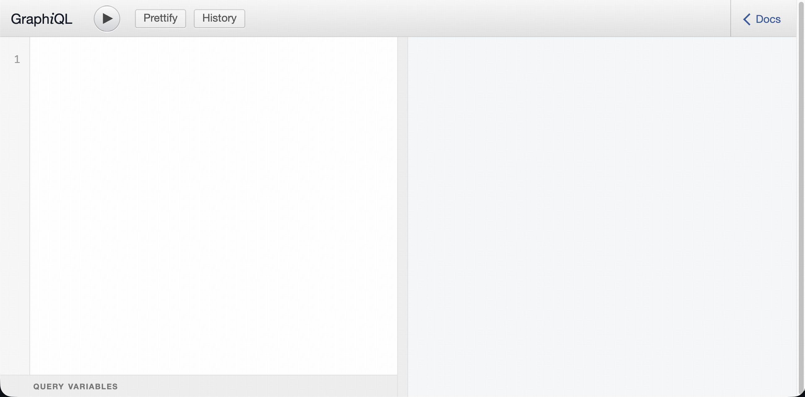

# Your first schema in five minutes

Goal: start TiDB GraphQL with a sample database and run a query in GraphiQL.

## Prerequisites

- Docker or Podman with Compose support

## 1) Clone and start

```bash
git clone https://github.com/benmeadowcroft/tidb-graphql.git
cd tidb-graphql
docker compose up
```

This starts a local TiDB instance with sample data and the TiDB GraphQL server with GraphiQL enabled. Wait for the log output to show that the server has started.

> **Podman users:** replace `docker compose` with `podman compose`, or use `make compose-up`.

## 2) Open GraphiQL

Visit [http://localhost:8080/graphql](http://localhost:8080/graphql) in your browser.

You should see a page that looks like this:



The **Docs** link in the top right opens the GraphiQL document explorer for browsing the generated schema.

## 3) Run a query

Paste the following query into GraphiQL. It fetches orders with their line items, product details, and customer information — all resolved automatically from the database foreign keys.

```graphql
query {
  orders(first: 3) {
    nodes {
      id
      status
      total
      orderItems(first: 5) {
        nodes {
          orderId
          productId
          quantity
          unitPrice
          product { name sku }
        }
      }
      user { fullName email }
    }
  }
}
```

`orderItems` in the tutorial dataset uses a composite key (`orderId`, `productId`), so both fields are exposed in GraphQL.

That's it! You have a working GraphQL API backed by TiDB. No manual schema files, no resolver boilerplate — TiDB GraphQL introspects your database and generates the GraphQL schema automatically.

## Stopping and resetting

```bash
docker compose -f examples/compose/quickstart/docker-compose.yml down      # stop containers (data persists)
docker compose -f examples/compose/quickstart/docker-compose.yml down -v   # stop and delete all data (fresh start)
```

## Customizing

The quickstart scenario stores app settings in:

`examples/compose/quickstart/config/tidb-graphql/tidb-graphql.example.yaml`

Edit that file to customize database/server/observability settings.  
Use `.env` (from root `.env.example`) for runtime overrides like `TIGQL_IMAGE` and secrets.

Common settings in the quickstart YAML:

| Key | Default | Description |
|-----|---------|-------------|
| `server.port` | `8080` | HTTP server port |
| `observability.logging.format` | `text` | Log format (`json`, `text`) |
| `database.database` | `tidb_graphql_tutorial` | Database to expose via GraphQL |

See the [Configuration reference](../reference/configuration.md) for all available settings.

## Connecting to your own database

To connect to an existing TiDB instance instead of the bundled one, use the `remote-db` scenario:

```bash
cp examples/compose/remote-db/.env.example examples/compose/remote-db/.env
# Update TIGQL_DATABASE_DSN in examples/compose/remote-db/.env (or edit remote-db config YAML)
docker compose --env-file examples/compose/remote-db/.env -f examples/compose/remote-db/docker-compose.yml up
```

For more advanced setups (building from source, TLS/mTLS, DSN connection strings), see the [Build from source](../how-to/build-from-source.md) and [Database authentication](../how-to/database-auth.md) guides.

---
# Related Docs

## Next steps
- [Query basics](query-basics.md)
- [Local OIDC](local-oidc.md)

## Reference
- [Configuration reference](../reference/configuration.md)
- [Flags and environment variables](../reference/cli-env.md)

## Further reading
- [Schema handling](../explanation/schema-handling.md)
- [Query planning](../explanation/query-planning.md)

## Back
- [Tutorials home](README.md)
- [Docs home](../README.md)
