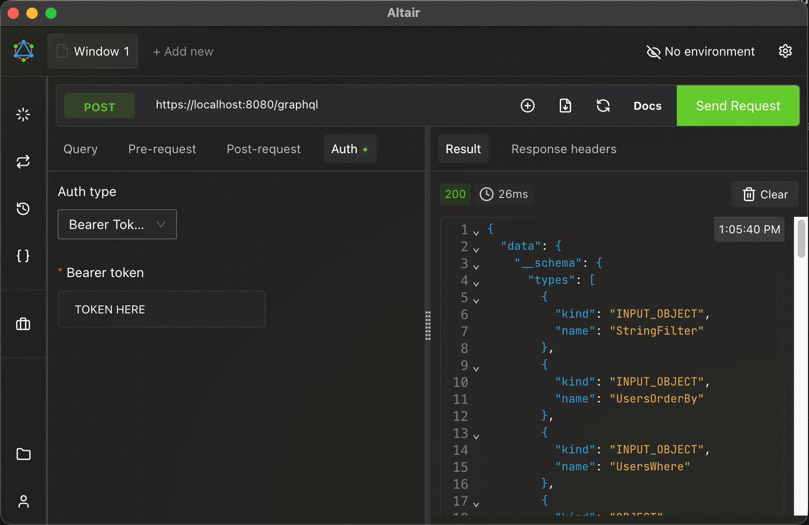

# Secure local dev with OIDC/JWKS

Goal: enable authentication locally without requiring a full OIDC (OpenID Connect) provider.

TiDB GraphQL uses OIDC discovery + JWKS (JSON Web Key Set). For local development use, you can use the built-in JWKS server with a self-signed TLS cert to test authentication and authorization without having to set up an OpenID Connect deployment. The TiDB GraphQL project provides some helper scripts to faciliatate developer testing, before you go to production with an actual OIDC/JWKS setup.

## 1) Generate local keys

First, we will generate some local keys. These artefacts will be used by our lightweight JWKS server, and to mint new JWS Tokens.

```bash
go run ./scripts/jwt-generate-keys
```

This writes JWT signing keys under `.auth/`. The JWKS server will generate its
own self-signed TLS certificate on first start.

## 2) Start the local JWKS server

We will provision the local JWKS server for development use on port 9000. YOu can add an ampersand `&` to run the server in the background.

```bash
go run ./scripts/jwks-server --addr :9000 --issuer https://localhost:9000 &
```

## 3a) Mint a token (without roles)

With a JWKS server running locally, we can now mint Java Web Tokens:

```bash
go run ./scripts/jwt-mint --issuer https://localhost:9000 --audience tidb-graphql --kid local-key
```

Copy the token output. This will be used as the Bearer token in your HTTPS requests to your GraphQL endpoints.

## 3b) Mint a token (with roles)

If you are planning to enable authorization using TiDB's RBAC with TiDB GraphQL then you should include the role you are claiming when minting the token. For example, if the database role you wish to claim is `app_admin` then mint a token using a command like this:

```bash
go run ./scripts/jwt-mint --issuer https://localhost:9000 --audience tidb-graphql --kid local-key --db_role=app_admin
```

Copy the token output. This will be used as the Bearer token in your HTTPS requests to your GraphQL endpoints.

## 4) Enable OpenID Connect in the config

Enabling OpenID Connect turns on the authentication portion of the TiDB GraphQL server. We will also enable TLS/HTTPS for the server to provide an encrypted channel for the bearer token. Update the `server` section of your configuration file with the necessary details, e.g.:

```yaml
server:
  # enable self signed TLS/HTTPS for server
  port: 8080
  tls_mode: auto

  auth:
    # enable authentication
    oidc_enabled: true
    oidc_issuer_url: "https://localhost:9000"
    oidc_audience: "tidb-graphql"
    oidc_skip_tls_verify: true
```

Note: `oidc_skip_tls_verify` is a dev-only escape hatch for the self-signed cert. It logs a warning.

## 5) Enable RBAC in the config (Optional)

If you plan to use TiDB's RBAC with TiDB GraphQL then you must configure the database with the necessary user account and roles. See [Create a database user for role-based authorization](../how-to/db-user-for-roles.md), steps 1-4, for details.

After you have created a suitable database user, you should update the `database` settings of the config file to use these credentials.

Within the config file, you will also update the `server.auth.db_role_*` settings to use the newly provisioned role.

```yaml
database:
  host: localhost
  port: 4000
  user: tidb_graphql # user account to use with TiDB RBAC
  database: tidb_graphql_tutorial

server:
  # enable self-signed TLS/HTTPS for server
  port: 8080
  tls_mode: auto

  auth:
    # enable authentication
    oidc_enabled: true
    oidc_issuer_url: "https://localhost:9000"
    oidc_audience: "tidb-graphql"
    oidc_skip_tls_verify: true

    # enable authorization
    db_role_enabled: true
    db_role_claim_name: "db_role"  # JWT claim containing the role name
    db_role_validation_enabled: true  # Validate role against discovered roles
    db_role_introspection_role: "app_introspect" # role to assume for introspection
```

## 6) Call GraphQL with the token

If you have curl on your system, the following will enable you to quickly validate connectivity to the GraphQL endpoint.

```bash
curl -H "Authorization: Bearer <TOKEN>" \
  -H "Content-Type: application/json" \
  -d '{"query":"{ __typename }"}' \
  -k \
  https://localhost:8080/graphql
```

If you remove the token, requests should be rejected. That is your sanity check.

Note that the basic GraphiQL deployment does not support setting the `Authorization: Bearer <TOKEN>` directly. I would recommend using a richer GraphQL client like:
- [Altair GraphQL Client](https://altairgraphql.dev/)
- [Apollo Client Devtools](https://www.apollographql.com/docs/react/development-testing/developer-tooling#apollo-client-devtools)
- [Postman](https://learning.postman.com/docs/sending-requests/graphql/graphql-client-interface/)

For example, the Altair GraphQL Client allows for Bearer Token authenticaiton in the Auth tab of the UI:



---
# Related Docs

## Next steps
- [DB user for roles](../how-to/db-user-for-roles.md)
- [Configure OIDC/JWKS auth](../how-to/oidc-jwks-auth.md)

## Reference
- [Auth reference](../reference/auth.md)
- [Configuration reference](../reference/configuration.md)

## Further reading
- [Database-first auth](../explanation/database-first-auth.md)
- [Middleware architecture](../explanation/middleware-architecture.md)

## Back
- [Tutorials home](README.md)
- [Docs home](../README.md)
